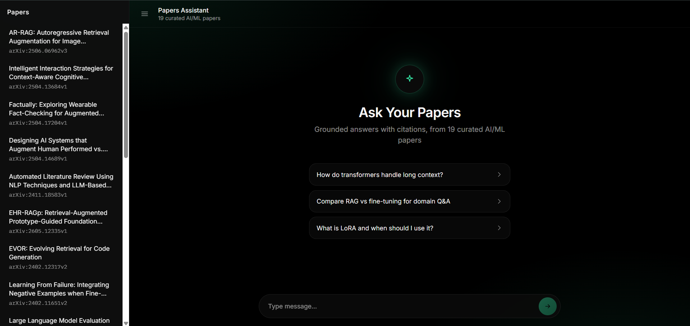
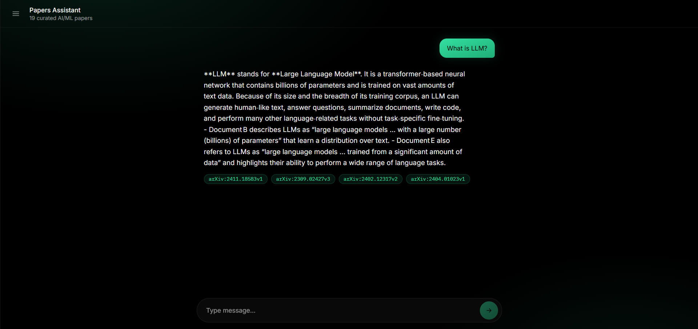

# 📚 Papers Assistant

**A production-style Retrieval-Augmented Generation (RAG) system for querying a curated corpus of AI/ML research papers — with citations, evaluation, and a live public demo.**

[](https://rag-papers-assistant.vercel.app)
[](https://rag-papers-assistant-api.onrender.com)

<p align="center">
  
  
  
  
  
  
  
  
  <br>
  
  
  
  
  
  
  
  
</p>

---

## 🔗 Live Demo

**[rag-papers-assistant.vercel.app](https://rag-papers-assistant.vercel.app)**

> ⏳ The backend runs on Render's free tier, which spins down after 15 minutes of inactivity. The first request after a period of idle time may take 30–50 seconds to wake up — this is expected, not a bug.

<!-- 📸 Add a screenshot of the empty state here, e.g.: -->
<!--  -->

<!-- 📸 Add a screenshot of a conversation with citations here, e.g.: -->
<!--  -->

---

## 🧠 What This Is

Papers Assistant is a RAG chatbot that answers questions grounded in a curated set of **19 AI/ML research papers** spanning retrieval-augmented generation, LLM agents, and fine-tuning. Every answer is traceable back to the specific source documents it was drawn from — the system is explicitly instructed to say "I don't know" rather than hallucinate when the corpus doesn't contain an answer.

This isn't a basic "chat with a PDF" demo. It's built as a **production-style system**, with:

- A real evaluation pipeline (RAGAS) measuring faithfulness, relevancy, precision, and recall
- Observability via LangSmith tracing
- A dev/prod split — fully local (Ollama + Chroma) for development, cloud-hosted (Groq + Qdrant Cloud) for the public deployment
- A custom-built frontend, not a generic Gradio/Streamlit wrapper
- A genuinely debugged deployment (see [Deployment Notes](#-deployment-notes--what-actually-broke) below — nothing here is theoretical)

---

## 🏗️ Architecture

```
┌─────────────────┐         ┌──────────────────────┐
│   Next.js UI     │────────▶│   FastAPI Backend      │
│   (Vercel)       │  HTTPS  │   (Render)             │
└─────────────────┘         └──────────┬────────────┘
                                        │
                     ┌──────────────────┼──────────────────┐
                     ▼                  ▼                  ▼
             ┌───────────────┐  ┌──────────────┐  ┌────────────────┐
             │  LlamaIndex    │  │  LangChain    │  │  LangSmith      │
             │  (retrieval)   │  │  (chain /      │  │  (tracing /     │
             │                │  │  orchestration)│  │  observability) │
             └───────┬───────┘  └──────┬───────┘  └────────────────┘
                     │                  │
                     ▼                  ▼
          ┌────────────────────┐  ┌──────────┐
          │  Qdrant Cloud        │  │  Groq     │
          │  (vector store,       │  │  (LLM      │
          │  production)          │  │  inference)│
          └────────────────────┘  └──────────┘
```

**Why LlamaIndex *and* LangChain, rather than just one?** Each owns a distinct responsibility instead of overlapping:
- **LlamaIndex** handles ingestion, chunking, and retrieval — it's purpose-built for turning documents into a searchable index.
- **LangChain** handles orchestration — prompt construction, the retrieval→generation chain, and swapping LLM providers via a single config flag.

### Dev vs. Production

| Component | Local Development | Production (Deployed) |
|---|---|---|
| LLM | Ollama (`llama3.2:1b`) | Groq (`openai/gpt-oss-20b`) |
| Vector Store | ChromaDB (local disk) | Qdrant Cloud |
| Embeddings | HuggingFace, in-process | HuggingFace Inference API (hosted) |
| Backend | `localhost:8000` | Render |
| Frontend | `localhost:3000` | Vercel |

Both paths are controlled by two environment variables (`LLM_PROVIDER`, `VECTOR_STORE_PROVIDER`) — the same codebase runs in both places, no forked logic. This mirrors a real-world pattern: prototype cheaply and offline, deploy against managed cloud services.

---

## ✨ Features

- **Grounded, cited answers** — every response links back to the specific paper(s) it drew from, with relevance scores
- **Refuses gracefully** when a question falls outside the corpus, instead of hallucinating
- **19-paper curated corpus**, fetched programmatically from the arXiv API, spanning RAG, LLM agents, and fine-tuning research
- **Custom chat interface** — built from scratch in Next.js/React/Tailwind, not a pre-built chatbot template
- **Full observability** — every query is traceable in LangSmith, showing retrieval, prompt construction, and generation as separate spans with latency and token counts
- **Measured, not assumed, quality** — RAGAS evaluation across 19 hand-written test questions (including deliberate out-of-corpus "trick" questions)

---

## 📊 Evaluation

Evaluated using [RAGAS](https://github.com/explodinggradients/ragas) across 19 test questions spanning RAG, LLM agents, fine-tuning, and 3 deliberately out-of-corpus "trick" questions (to confirm the system correctly declines to answer rather than hallucinating).

| Metric | Score | What it measures |
|---|---|---|
| **Faithfulness** | 0.83 | Are claims in the answer actually supported by retrieved context? |
| **Answer Relevancy** | 0.92 | Does the answer address the question asked? |
| **Context Precision** | 0.996 | Of the retrieved chunks, how many were relevant? |
| **Context Recall** | 0.67 | Did retrieval surface *all* the relevant information available? |

**Honest read on Context Recall (0.67):** this was the one clear weak point. Diagnosis: high precision + moderate recall pointed to *insufficient retrieval breadth* rather than noisy retrieval — the system was pulling accurate but incomplete context for broad conceptual questions (e.g., "What is an LLM agent?"). An attempted fix (raising `top_k` from 5 to 10) was tested locally, but re-measuring it hit a wall: evaluating with a local LLM-as-judge on constrained hardware produced too many timeouts/parse failures to get a reliable second measurement (see below). The fix was reverted in favor of keeping the last *fully verified* configuration, and this is documented here as a known area for future work (candidates: reranking, or re-running the comparison with a cloud-hosted judge model).

This kind of "found a real limitation, tried a fix, hit a genuine constraint, made a documented decision" trail is arguably more representative of real engineering than a suite of clean green checkmarks.

---

## 🛠️ Deployment Notes — what actually broke

In the interest of an honest project writeup, here's what deployment actually surfaced (none of this is hypothetical — every item below caused a real failed deploy that had to be diagnosed):

- **Python version mismatches.** Render's default Python (3.14) was too new for several ML dependencies, and pinning too far back (3.11) broke a different one (`numpy` required ≥3.12). Landed on 3.12 as the version satisfying every dependency's constraints.
- **Platform-specific dependencies.** A `pip freeze` on Windows captured `pywin32`, a Windows-only package with no Linux equivalent — silently fatal on Render's Linux containers until removed.
- **Memory ceiling on the free tier.** Render's free tier caps out at 512MB RAM. Loading a HuggingFace embedding model in-process (via `sentence-transformers`/`torch`) alone exceeded that. Solved by moving query-time embeddings to HuggingFace's hosted Inference API in production only — local development still embeds in-process, where memory isn't a constraint.
- **LangSmith tracing silently failing (403 Forbidden).** Root cause took real diagnosis to find: the account's workspace lives on LangSmith's **EU** infrastructure, while the SDK's default endpoint is **US** — meaning the API key was valid, but every ingest call was hitting the wrong regional endpoint. Fixed with one explicit endpoint override (`LANGSMITH_ENDPOINT`), once correctly diagnosed via testing the same key against each regional endpoint directly.

---

## 💻 Tech Stack

**Backend:** Python · FastAPI · LangChain · LlamaIndex · ChromaDB / Qdrant · Ollama / Groq · HuggingFace embeddings

**Frontend:** Next.js (App Router) · TypeScript · React · Tailwind CSS

**Evaluation & Observability:** RAGAS · LangSmith

**Infrastructure:** Render (backend hosting) · Vercel (frontend hosting) · Qdrant Cloud (vector database) · Groq (LLM inference)

**Data:** arXiv API (paper ingestion) · `pypdf` (text extraction)

---

## 🚀 Running Locally

### Prerequisites
- Python 3.12
- Node.js 18+
- [Ollama](https://ollama.com) installed, with `llama3.2:1b` pulled: `ollama pull llama3.2:1b`

### Backend

```bash
cd backend
python -m venv venv
venv\Scripts\activate        # Windows
# source venv/bin/activate   # macOS/Linux
pip install -r requirements.txt
```

Create `backend/.env` with (at minimum, for local dev):
```
LLM_PROVIDER=ollama
VECTOR_STORE_PROVIDER=chroma
```

Fetch the paper corpus and build the local index:
```bash
python -m app.ingestion.fetch_papers
python -m app.ingestion.build_index
```

Run the API:
```bash
uvicorn app.api.main:app --reload --port 8000
```

### Frontend

```bash
cd frontend
npm install
npm run dev
```

Visit `http://localhost:3000`.

---

## 📁 Project Structure

```
rag-papers-assistant/
├── backend/
│   ├── app/
│   │   ├── ingestion/     # arXiv fetching, PDF parsing, chunking, indexing
│   │   ├── chains/        # LangChain orchestration + LlamaIndex retrieval
│   │   ├── evaluation/    # RAGAS test set + evaluation runner
│   │   └── api/           # FastAPI routes
│   └── requirements.txt
└── frontend/
    └── src/app/
        └── components/    # Chat interface, paper list sidebar
```

---

## 🗺️ Roadmap

- [ ] Reranking layer to address the context recall gap identified in evaluation
- [ ] Restrict CORS to the production frontend domain (currently permissive for development convenience)
- [ ] A companion project applying LangGraph to build genuine agentic behavior (tool use, multi-step reasoning) — kept as a separate repo by design, to keep this project's scope focused on RAG fundamentals

---

